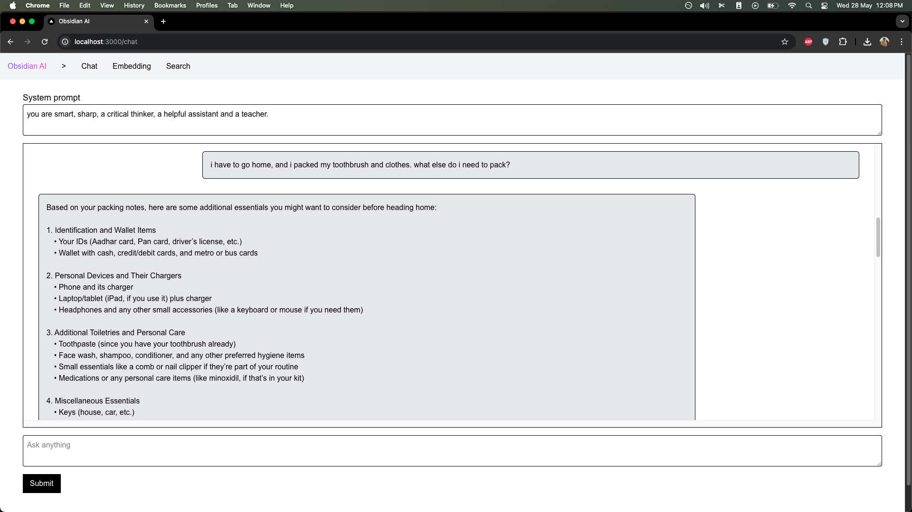
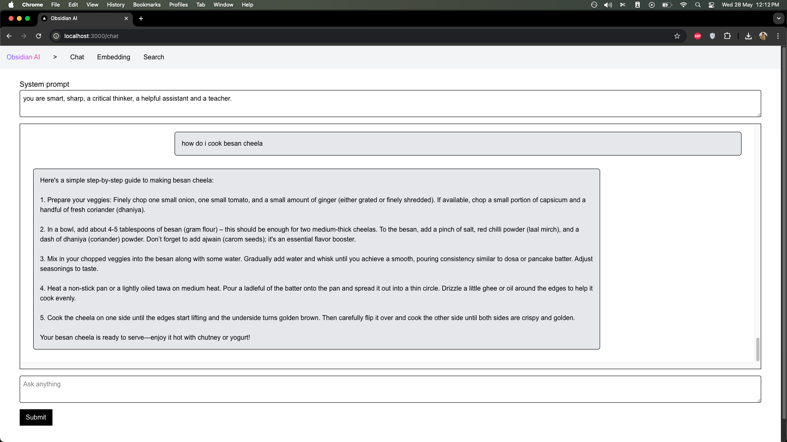
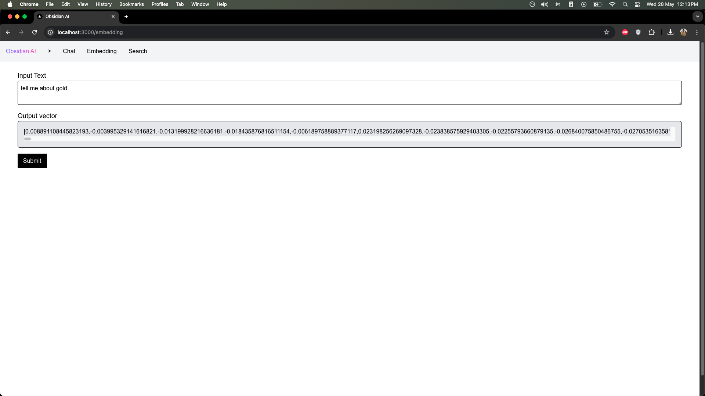
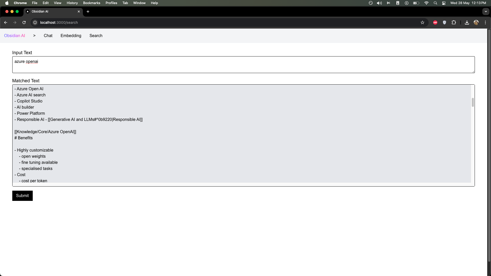

# Obsidian AI

Use RAG to query OpenAI using your markdown notes as context.

I use it to ask questions with my Obsidian based notes as reference.

## Screenshots

### Chat

Chat with your notes as context.

### Embeddings

Get embeddings of an input text.

## Search

Search the context in your notes that matches the input text.

## Setup

You will need

- A chat completion model hosted on Azure OpenAI
- A text embedding model hosted on Azure OpenAI
- A local ChromaDB installation, for storing your embeddings
- Your Markdown notes

### Installation

1. Clone the repository
2. Install the Next.js dependencies
   1. `npm install` to install dependencies for the app
3. Install the Python dependencies
   1. `cd src/scripts`
   2. `pip install -r requirements.txt`
4. Install [ChromaDB](https://docs.trychroma.com/cli/install)

### Create a .env file

Use `.env.sample` as a template and fill in your OpenAI and ChromaDB details

### Build the app

1. Go into the project directory - `cd /path/to/obsidian-ai`
2. Build the app - `npm run build`

### Create embeddings from your notes

1. Go into the project directory - `cd /path/to/obsidian-ai`
2. Run ChromaDB - `chroma run`
3. Run the app - `npm run start`
4. Run `python src/scripts/embedFiles.py "/path/to/notes"`, this will start embedding your notes and storing them into ChromaDB
   1. example - `python src/scripts/embedFiles.py "/Users/pranavsindura/Obsidian Notes/Personal"`

### Run the app

1. Go into the project directory - `cd /path/to/obsidian-ai`
2. Start ChromaDB - `chroma run`
3. Start the app - `npm run start`
4. Open `http://localhost:3000` in your browser
